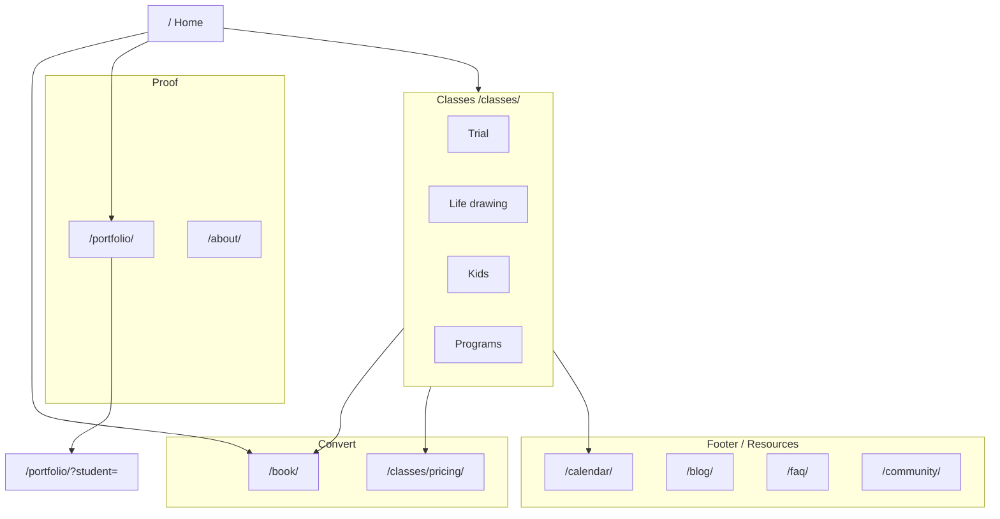

# Art Tutor Hanoi — Site Information Architecture

**Domain:** https://arttutorhanoi.com  
**Last updated:** 2026-05-29  
**Purpose:** Reference for rebuilding the public site (`v2/`, new theme, or headless). Use with `sitemap.csv` for URL mapping and redirects.

---

## 1. Business goals (IA drivers)

| Priority | Goal | Primary pages |
|----------|------|----------------|
| P0 | Book trial / first visit | Book trial, Classes hub, Pricing |
| P1 | Choose a class type | Life drawing, Kids, Courses, Calendar |
| P2 | Trust & proof | Portfolio, About, student stories |
| P3 | SEO & retention | Blog/tutorials, FAQ, community, supplies |

**Conversion path (target):** Home → Class type → Price / calendar → Book trial → WhatsApp/Zalo follow-up.

---

## 2. Current site (WordPress) — header navigation

Theme: `masu-wpcom`. Navigation block (same on all cached pages).

### 2.1 Primary items

| Label | Current URL | Type |
|-------|-------------|------|
| *(Logo)* | `/` | Home |
| About us | `/meet-the-artists/` | Page |
| Nude Drawing Class | `/nude-drawing-class/` | Page |
| Kids Art Class | `/art-tutor-for-kids-eng/` | Page / MEC event |
| Students' Artworks | `/students-artworks/` | Page (archive hub) |

### 2.2 Submenu “Links” (11 items)

| Label | Current URL |
|-------|-------------|
| Calendar | `/weekly-calendar/` |
| Courses | `/art-tutor-fine-art-courses-hanoi/` |
| Price | `/art-class-pricing-in-hanoi/` |
| FAQ | `/faq/` |
| Art Supplies | `/hanoi-art-supply-map/` |
| Art Tutorials | `/art-tutorials/` |
| Join Our Art Community | `/join-our-art-community/` |
| “Living Colors” Exhibition 2025 | `/exhibitionlivingcolors2025/` |
| Art feedback | `/free-art-feedback/` |
| — More — | `/link/` |

**Known issues:** Trial booking is not in the header (only repeated CTAs in page body). Submenu is overloaded. Label “Links” is unclear.

---

## 3. Homepage-only links (body, not in menu)

These appear on `/` in addition to global header/footer.

| Element | URL | Notes |
|---------|-----|-------|
| Book a trial session (CTA ×3) | `/book-a-trial-art-session-art-tutor-hanoi/` | Main conversion |
| Next event — Kids Art Class | `/art-tutor-for-kids-eng/` | MEC widget |
| Student samples | `/emma/`, `/tayuna/`, `/jay-ryu/` | Single posts |
| Complete list of students | `/students-artworks/` | Hub |

Live homepage may also promote four service cards (Trial, Life Drawing, Self-Study, Kids) — confirm slugs in WP admin if URLs differ from cache.

---

## 4. Full page inventory (production URLs)

Slug list from `wp-content/boost-cache/cache/arttutorhanoi.com/` plus live checks.

### 4.1 Core pages

| Slug | Role | Tier |
|------|------|------|
| `/` | Home | P0 |
| `/book-a-trial-art-session-art-tutor-hanoi/` | Trial booking | P0 |
| `/art-tutor-fine-art-courses-hanoi/` | 12 fine-art programs | P0 |
| `/art-class-pricing-in-hanoi/` | Pricing | P0 |
| `/weekly-calendar/` | Class & event calendar (MEC) | P0 |
| `/faq/` | FAQ | P1 |
| `/nude-drawing-class/` | Life / nude drawing | P1 |
| `/art-tutor-for-kids-eng/` | Kids classes / events | P1 |
| `/meet-the-artists/` | About instructors | P1 |
| `/students-artworks/` | Student work gallery (WP) | P2 |

### 4.2 Supporting & community

| Slug | Role | Tier |
|------|------|------|
| `/hanoi-art-supply-map/` | Art supplies map | P3 |
| `/art-tutorials/` | Tutorials / blog landing | P3 |
| `/join-our-art-community/` | Community | P3 |
| `/free-art-feedback/` | Free feedback offer | P3 |
| `/exhibitionlivingcolors2025/` | Exhibition 2025 | P3 |
| `/link/` | External links hub (OTA, promo) | P3 |

### 4.3 Student profile posts (examples)

Dynamic; many more exist in WP.

| Slug | Example |
|------|---------|
| `/emma/` | Student story + work |
| `/jay-ryu/` | Student story + work |
| `/tayuna/` | Student story + work |

### 4.4 Blog categories (archives)

| Category slug | Purpose |
|---------------|---------|
| `/category/blog/` | General blog |
| `/category/courses/` | Course-related posts |
| `/category/art-tutorials/` | Tutorials |
| `/category/drawing-techniques/` | Drawing |
| `/category/painting-techniques/` | Painting |
| `/category/pencil-basic-1/` | Course series |
| `/category/pencil-basic-2/` | Course series |
| `/category/art-tutorials/studio-insights-art-education/` | Studio insights |
| `/category/uncategorized/` | Legacy |

### 4.5 Systems outside WordPress pages

| Path | Stack | Role |
|------|-------|------|
| `/portfolio/?student={slug}` | PHP + Cloudinary (`portfolio/`) | Per-student portfolio (canonical for rich profiles) |
| `/v2/index.html` | Static prototype | New design WIP |

### 4.6 Footer URL mismatches (`v2/index.html` vs live WP)

Fix when wiring `v2` to production:

| v2 footer link | v2 uses | Live WP slug |
|----------------|---------|--------------|
| Calendar | `/calendar/` | `/weekly-calendar/` |
| Art Supplies | `/art-supplies/` | `/hanoi-art-supply-map/` |
| Art Fundamentals | `/art-fundamentals/` | *(verify in WP — may not exist)* |
| Art Feedback | `/art-feedback/` | `/free-art-feedback/` |
| Exhibition 2026 | `/exhibition-2026/` | `/exhibitionlivingcolors2025/` |

---

## 5. Proposed IA (new site)

### 5.1 Header menu (max 6 items)

| # | Label | Proposed path | Maps from (current) |
|---|-------|---------------|---------------------|
| 1 | **Book a Class** | `/book/` | `book-a-trial-art-session-art-tutor-hanoi` |
| 2 | **Classes** | `/classes/` | Hub: courses + nude + kids + self-study |
| 3 | **Workshops** | `/calendar/` | `weekly-calendar` + MEC events |
| 4 | **Portfolio** | `/portfolio/` | `students-artworks` + PHP portfolio app |
| 5 | **About** | `/about/` | `meet-the-artists` |
| 6 | **FAQ** | `/faq/` | `faq` |

Sticky CTA (all pages): **Book trial** → `/book/`.

### 5.2 Classes hub (`/classes/`)

| Child | Proposed path | Current slug |
|-------|---------------|--------------|
| Trial session | `/book/` or `/classes/trial/` | `book-a-trial-art-session-art-tutor-hanoi` |
| Life drawing | `/classes/life-drawing/` | `nude-drawing-class` |
| Kids | `/classes/kids/` | `art-tutor-for-kids-eng` |
| Self-study studio | `/classes/self-study/` | *(confirm in WP)* |
| Fine art programs (12) | `/classes/programs/` | `art-tutor-fine-art-courses-hanoi` |
| Pricing | `/classes/pricing/` or anchor on hub | `art-class-pricing-in-hanoi` |

### 5.3 Footer (Resources)

| Label | Proposed path | Current slug |
|-------|---------------|--------------|
| Calendar | `/calendar/` | `weekly-calendar` |
| Art Supplies | `/resources/art-supplies/` | `hanoi-art-supply-map` |
| Art Tutorials | `/blog/` or `/resources/tutorials/` | `art-tutorials` |
| Join Community | `/community/` | `join-our-art-community` |
| Art Feedback | `/resources/feedback/` | `free-art-feedback` |
| Exhibition | `/exhibition/` | `exhibitionlivingcolors2025` |
| More links | `/links/` | `link` |

### 5.4 Architecture diagram

---

## 6. Redirect plan (301)

When launching new paths, redirect every old slug (see `sitemap.csv` column `redirect_to_proposed`).

**Rules:**

1. Never chain redirects (old → new in one hop).
2. Keep `/portfolio/?student=*` query strings.
3. Preserve trial UTM landing on `/book/`.
4. Update Rank Math + Search Console after cutover.

**High-priority redirects:**

| From | To (proposed) |
|------|----------------|
| `/book-a-trial-art-session-art-tutor-hanoi/` | `/book/` |
| `/art-tutor-fine-art-courses-hanoi/` | `/classes/programs/` |
| `/art-class-pricing-in-hanoi/` | `/classes/pricing/` |
| `/weekly-calendar/` | `/calendar/` |
| `/nude-drawing-class/` | `/classes/life-drawing/` |
| `/art-tutor-for-kids-eng/` | `/classes/kids/` |
| `/meet-the-artists/` | `/about/` |
| `/students-artworks/` | `/portfolio/` |
| `/hanoi-art-supply-map/` | `/resources/art-supplies/` |
| `/free-art-feedback/` | `/resources/feedback/` |
| `/join-our-art-community/` | `/community/` |
| `/exhibitionlivingcolors2025/` | `/exhibition/` |
| `/link/` | `/links/` |
| `/art-tutorials/` | `/blog/` |

Student posts (`/emma/`, etc.): redirect to `/portfolio/?student=emma` or keep legacy URLs with canonical to portfolio.

---

## 7. `v2/` prototype alignment

File: `v2/index.php` (PHP includes) / `v2/index.html` (static build) — shared **header, footer, CSS, JS** in:

| Path | Role |
|------|------|
| `v2/partials/header.html` | Site header + nav |
| `v2/partials/footer.html` | Site footer |
| `v2/partials/home-content.html` | Homepage body only (hero → map) |
| `v2/partials/head.php` | `<head>` + `<base>` for PHP pages |
| `v2/assets/css/main.css` | All styles |
| `v2/assets/js/main.js` | Nav, gallery, sliders, community panel |
| `v2/build.ps1` | Regenerate `index.html` after editing partials |

Run `build.ps1` after changing partials if you need static `index.html` without PHP.

| `v2/about.php` | About page (team, story, map) |
| `v2/data/teachers.php` | Instructor data + Cloudinary public IDs |
| `v2/config/cloudinary.php` | `cld_teacher_photo()`, `cld_studio_image()` (cloud `dwy4wtjtc`) |
| `v2/data/studio-images.php` | About page photos — folder `website/image/studio` |

| v2 nav label | URL (interim until new paths live) |
|--------------|-------------------------------------|
| About | `/meet-the-artists/` |
| Workshops | `/workshops/` |
| → Trial Art Class | `/book-a-trial-art-session-art-tutor-hanoi/` |
| → Nude Model Drawing | `/nude-drawing-class/` |
| → Silk Painting | `/workshops/` (silk section on page) |
| → Artist Residency | `/artist-residency/` |
| Adults | `/art-tutor-fine-art-courses-hanoi/` |
| → Courses | `/art-tutor-fine-art-courses-hanoi/` |
| → Portfolio Preparation | `/art-tutor-fine-art-courses-hanoi/` *(dedicated slug TBD)* |
| Kids | `/art-tutor-for-kids-eng/` |
| → Courses | `/art-tutor-for-kids-eng/` |
| → Portfolio Building | `/art-tutor-for-kids-eng/` *(dedicated slug TBD)* |
| Pricing | `/art-class-pricing-in-hanoi/` |
| Calendar | `/weekly-calendar/` |
| Header CTA “Book a Class” | `/book-a-trial-art-session-art-tutor-hanoi/` |

**Footer Resources:** Calendar, FAQ, Art Supplies, Art Tutorials | Art Feedback, Join Community, Exhibition 2025, More links (`/link/`).

Card section `href`s on homepage body may still use `#` — update separately when wiring content blocks.

---

## 8. Technical notes

| Item | Detail |
|------|--------|
| Theme | `masu-wpcom` (block theme, FSE) |
| Events | Modern Events Calendar (`mec-*` on pages) |
| Galleries | Modula + Cloudinary |
| SEO | Rank Math (sitemap index currently errors 500 — fix before launch) |
| Booking | BookingPress (export dir in uploads) |
| Portfolio app | `portfolio/` — Google Sheet / Cloudinary; not WP posts |

---

## 9. Related files

| File | Description |
|------|-------------|
| `sitemap.csv` | Machine-readable URL list: current, proposed, tier, nav placement |
| `v2/index.html` | Static redesign prototype |
| `portfolio/` | Student portfolio application |

---

## 10. Open items for PM / content

- [ ] Confirm **Self-Study Studio** slug in WordPress  
- [ ] Decide: student posts (`/emma/`) vs only `/portfolio/?student=`  
- [ ] Resolve footer URLs in `v2` (section 4.6)  
- [ ] Fix `sitemap_index.xml` 500 before migration  
- [ ] Map “Art Fundamentals” page if it exists under another slug  
